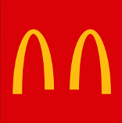
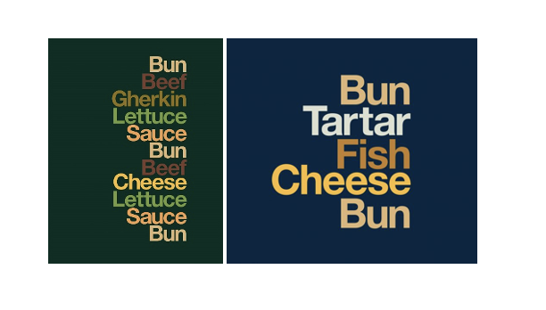

 

There are many logos most of us are extremely familiar with – be it because they have been heavily advertised, or they represent a company whose products we use and value. 

Although some companies’ logos surround us almost every step on our way to school or work – maybe even more than you realise – we more often than not fail to notice changes in the logo’s design.

There is so much information surrounding us daily that our brains cannot comprehend and assimilate changes that are of no immediate concern. Thus, when you pass towards that McDonald’s on your way to school for years on a row, chances are you do not notice anything different. Truth is, most of the time, regular changes in iconic logos are so small, that there is no surprise a by-walker does not see them. 

However, even the slightest modifications have an entire design team behind them, making sure they are doing everything they can to keep the logo in line with the company’s values and aesthetics, whilst also making sure it is as appealing to the consumers as possible.  

Let me go back to the McDonald’s example. In the last 15 years, McDonald’s has had six main, successful logo changes and several failed attempts. 

The illustration below shows the fast-food chain’s logo evolution throughout the years. To the untrained, unobserving eye, the last six versions might look quite similar. However, each of them conveys a different message and feel. The high-contrast, minimalistic logo from 2006-present features a simple, straight-forward image without mention of the company’s name itself. It’s evident that what is successful about this logo is the popularity and familiarity of McDonald’s globally. People – consumers of this brand or not – immediately know what the iconic overarching yellow M stands for and the company’s values.

.")

However, there have also been some heavily criticized logo changes for the established fast-food chain. In March 2020, amid the pandemic, McDonald’s revealed a minimalist ad in which its two famous yellow arches were “separated for a moment so that we can always be together”. The ad took over social media platforms across Brazil and the backlash received from people unimpressed with the tasteless logo was quite fierce. The company soon took the ads down, deleted all social media posts, and issued an apology: “As a brand that operates in nearly 120 countries, we share a collective responsibility to help our communities in times of need. We apologise for any misunderstanding of the intent to remind our customers and communities on the importance of social distancing during these uncertain times.”

It is quite clear that in McDonald’s case, it is better to stick with the minimalist, easily recognizable logo, rather than have a failed attempt at a creative, fun ad. This is not to say that they have not had some successful bold moves in the past, such as the type-only ads from early 2020 featuring just a list of ingredients from their most famous products (shown below). Although consumers associate McDonald’s with their arching M in red and yellow hues, these types of ads convey simplicity and some sort of sophistication. Apparently, neutral colors that match the ingredient itself, low-contrast, right-aligned list of words on a dark green, brown or blue background works for McDonald’s.

With all the creative and design team working on McDonald’s logos and ads, they somehow manage to make a simple, type-only, neutral ad without the company’s logo in sight work. But then again, if any brand could pull it off, it would be one of the most recognizable fast-food chain on the planet. 

Everything about the way this massive corporation uses typeface is emblematic. From the low-contrast, straight-forward font, to the popular red-yellow combination that attracts attention and, according to the founders, “whets the appetite”. With a sense of joy and good humor, the McDonald’s logo has become one of the most recognizable globally. Of course, it also helps that they are one of the best-selling fast-food chains, with £15 billion pounds revenue worldwide in 2020.