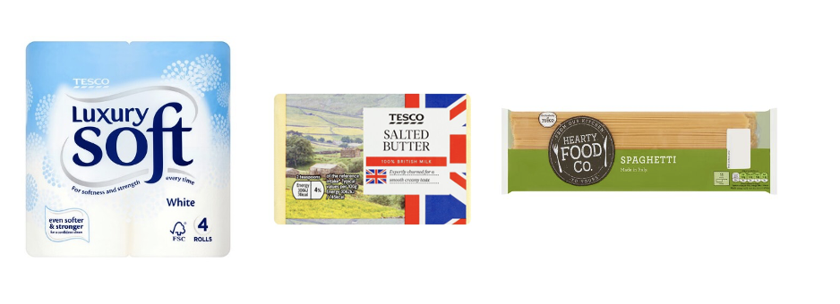
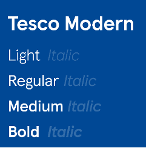
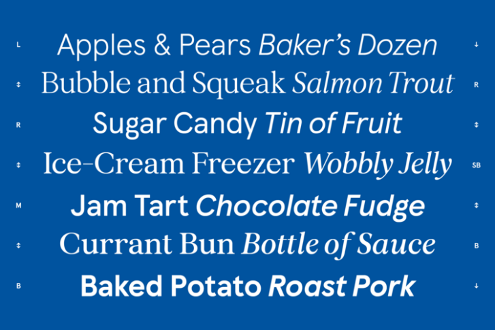

Behind your most beloved items in your shopping cart, there is an entire team working to make sure you reach out to that specific shelf. 

From the history of the TESCO logo and use of colours, to the intricate typographical differences between character styles, it is most certain that the supermarket chain knows its consumers and how to visually attract them. 

So, what are Tesco products really telling you?

Firstly, it is important to mention that typography plays a crucial role when it comes to marketing and the way different products are advertised to consumers. Tesco is one of the most popular supermarket chains in the United Kingdom, with 75 percent of positive opinion from consumers. With over four thousand stores in 2020 and more than 1600 product lines across both the Tesco Value and Tesco Finest, it is of no surprise that some of the products depicted below are most likely present in your cupboard. 

The typography used has changed over the years, constantly harmonizing with the company’s values of a staid and reliable supermarket chain. Except for the very first version which featured a simple, sans-serif, all capitals, black TESCO STORES LTD, from the 1970s, the Tesco Logo was redesigned in a joyful red and yellow color palette, which later became the well-known and recognizable blue, red and white combination. 

The all-caps, regular weight, contrast and width logo leads towards a more empathic voice, thus attracting the broader masses.

The current typography choice is not only modern-looking and sleek, but also a reflection of the United Kingdom national flag, through its color palette and timeless design. The TESCO logo features a modern sans-serif, with the lines of the letters slightly extending to their ends, and their edges cut straight. 

When it comes to TESCO products and their typography, one can notice a range of typologies across all product lines. Versions of the re-envisioned Apercu font are seen across the entire Tesco universe – from the logo itself to product advertisement, and items across the Tesco’s finest range.

Tesco Modern, the font created by the Colophon Foundry especially for the supermarket chain, features Light, Regular, Medium and Bold weights, each mathematically and commercially relating to the purpose or range of said product. From the standard Apercu font, Tesco Modern had letters carefully and almost unnoticeably redesigned – that is, of course, if you do not have a keen eye for supermarket typography. The new drawings feature an increased x-height, making it easier on the eye, as well as wider lines towards the end of some letters, and several versions of condensed, regular, and extended width.

This new font is not so much about perfect symmetry and mathematical accuracy, as it is about carefully and consciously increasing eye comfort, character distinctiveness, and readability, and with it, consumers’ interaction with the product. 

And even when it comes to the packaging of products and their price, the designers made sure to use several different sizes and styles to give the grocer’s the sense of choice. It is also an accurate portrayal of how marketing works, with offers being marked with red or yellow eye-catching labels, whereas information that is not crucial is written at the bottom in smaller fonts. 

For Tesco’s Finest line, a more classical serif was drawn to embody a more sophisticated look for the supermarket’s higher-quality, higher-price products. All black, lowercase, leaning towards a more luxurious tone, this range of products attracts a specific type of shoppers. “Tesco Finest as a brand is one of the largest food brands in the country. We have a very high percentage of more upmarket customers,” chief executive of Tesco PLC said.

There is no doubt that British tradition and reliability are at the core of Tesco’s marketing strategy, also seen in their balanced, classic typography throughout every branch of the supermarket chain. 

Now, go ahead and do your groceries. I assure you it will never be the same again.