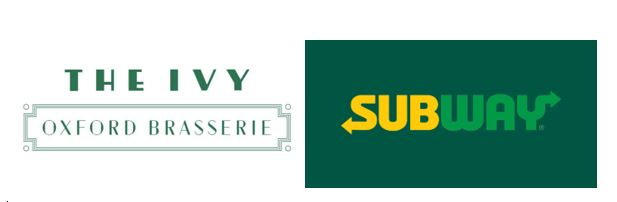
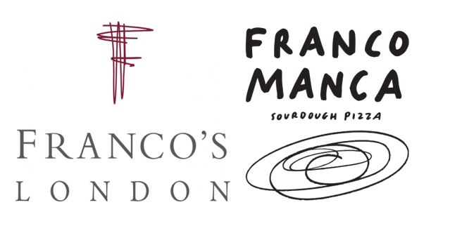

The uses of typography when it comes to the food industry are extensive. A change in a logo’s colour can completely shift the energy it gives off, and a font replacement makes our first impression different.

Restaurants use typography to convey a certain atmosphere, clientele, set of values, and even price range.

Walking around the city centre, trying to decide on a place for lunch is an action heavily influenced by fonts and colour and logos. There is a certain feel you get when you see The Ivy’s logo (shown below) – the choice of a high-contrast, dark green, all caps font leads to a modern, sophisticated look that will attract a potential client’s attention.

The straight, thin lines of the box around “Oxford Brasserie” and the overall sleek design indicate a certain atmosphere of preciousness and elegance. 
Contrastingly, the famous Subway logo attracts a different type of consumers. Although also featuring a dark green colour, its strategic purpose is the opposite of The Ivy’s. Complemented by yellow and vibrant green hues, Subway’s colour scheme is a sure way of attracting its young consumers. Conveying a sense of comfort, trust, safety, but also joy, fun and calm, the fast-food chain’s logo is successfully designed for its targeted audience – 18-24 middle-class young males. 
The font is quite suggestive as well. Characteristics such as its very low-contrast, all caps, sans-serif, rounded letters all give a sense of informality and friendliness, in contrast with The Ivy’s sophisticated and exclusive vibe.
It is clear how the same colour can be used in totally different logo designs and express contrasting ideas. 
Let’s look at another example of places that sell Italian food. Firstly, I will look into Franco’s, a fine dining restaurant in London, that has some of the best reviewed pizza, pasta, and overall experience in the UK. Secondly, Franco Manca is a casual, reasonably priced sourdough pizzeria with 55 locations in the UK. 

The logos below both include the word Franco, but the way typography is used in these two examples clearly underlines how much of a change can font and style make.  

The first one features serif, all-caps letters, in a monotype typeface. Much like The Ivy logo, wide space between letters (especially noticeable in the “London” text underneath), and the high contrast create a sophisticated look, perfectly suited for the brand. Even though the first letter F has a slightly higher x-height than the rest of the word – further contributing to its elegance and exclusiveness –, the logo is overall very symmetrical in arrangement and letter sizes and placement. 
The Franco Manca logo is intentionally “clumsy”, informal, and resembling hand-written text. The font seems to be specifically designed in-house, as there is nothing quite identical to it anyplace else. The modern, round, brush-like shapes are a sure way to create a logo that gives off an informal, fun, joyful, get-your-friends-together-and-come-eat-pizza energy. 
These two logos are perfect examples of the way a single word can be transformed to get totally different meanings, suitable for the brand it represents. 

It is thus clear that typography plays a crucial role in building a restaurant’s image, atmosphere, and, in some ways, clientele.