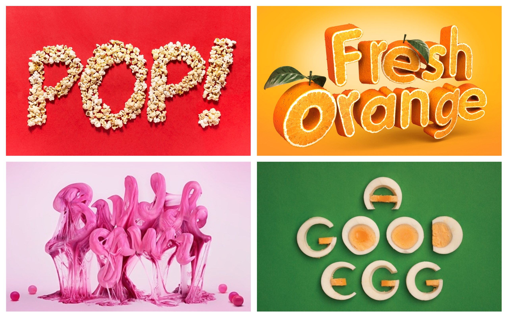

We all know those fonts that look so delicious, you’d like for a second to reach for them and see what those two-dimensional letters taste like.

Psychologically speaking, when our brains see something resembling food, the survival instinct switch turns on, making us crave what is right in front of our eyes. 
Of course, nowadays in a society ruled by consumerism, deliciously looking fonts are merely a way of attracting consumers to a certain product. Marketing and design teams take advantage of the self-preservation instinct to create logos such as the ones featured below that will instantly catch the eye of consumers passing by.
What I find even more interesting is when the letters of a logo are made of icons or images of the food it represents. Take for instance the plate filled with what appears to be strawberry jam that spells out, in a wobbly, handwritten font, *“You’re my jam.”*

Such a play of words and typography is well-thought out and eye-catching, but not entirely unique within the food industry.
Design teams, working closely with the marketing department, have figured out how to create an attractive logo by putting together letters that have been individually designed and created. When each letter is a design on its own, it is of no doubt a more difficult task to put everything together in a coherent, suitable-for-the-brand way. 

The example below is a testament of creativity and ingenuity – each letter of this design is a different type of mood. The *W* is made of two triangular watermelon slices, the *L* is made of individual pieces of chocolate, and the *I* is just a bottle of what seems to be beer. Although not entirely coherent – in the traditional type of way – this logo is unique and a sure way to attract the audience. 

Another example of ingenuity is making the logo of a food brand out of – *you guessed it* – that exact food. 

Deliciously looking and cleverly designed, these typographical examples are a testament of the hard work and creativity behind design teams.  

Below are some interesting videos that further explore the tight and fascinating relationship between food and typography. 

* <https://www.youtube.com/watch?v=IeWGoTRK0Y0> This video features the team of artists working on creating different words using something that looks like finely ground coffee.
* <https://www.youtube.com/watch?v=pnnRedSK0p4> This short CBC film is about Emily Cheung, a Vancouver-based graphic who uses food to create word art. Making letters out of grains, Skittles, or writing full words on a made-from-scratch-pizza, her art is delicious to look at and taste.

Emily Cheung perfectly sums up what any graphic designer enjoys about their work – and even more so when that involves food: ***“My favourite part about this is that we created something fun that involves play.”***