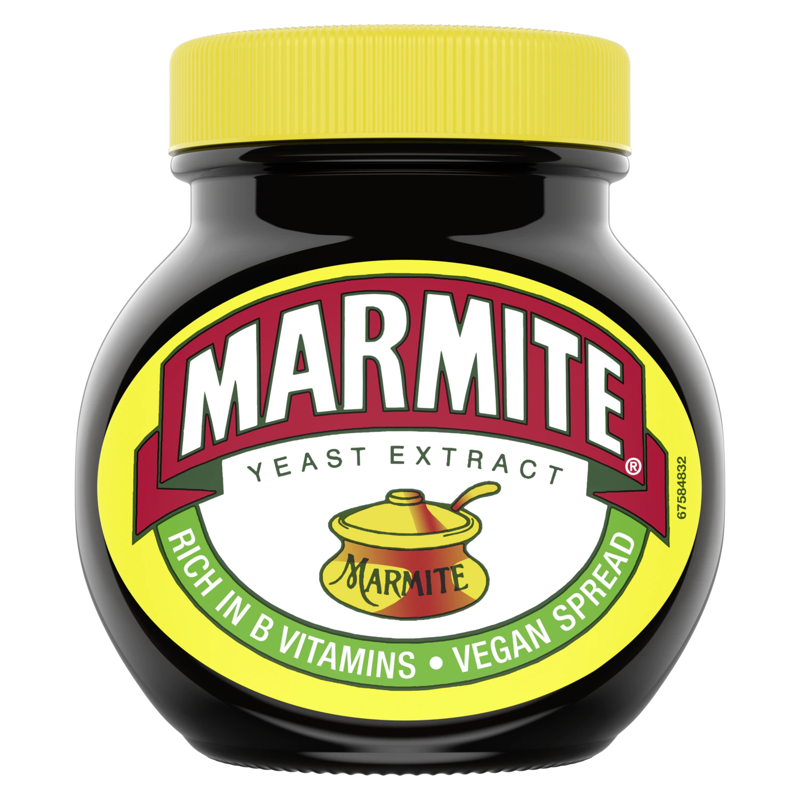
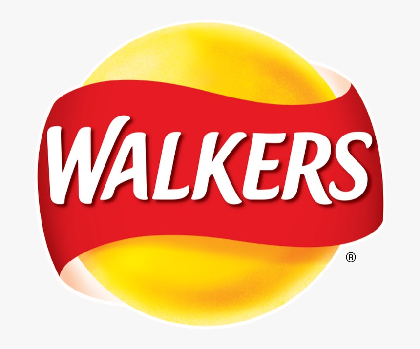
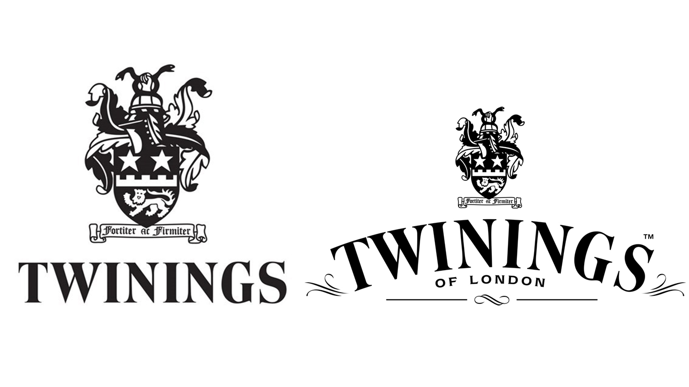

There are some brand logos that are instantly recognisable by anyone in the UK. Most of them have been around for quite some time, while others have become increasingly popular over the last few decade. 

Here are the TOP 5 most recognisable British food logos:

### 1. Marmite

The Marmite Food Company was founded in 1902 in Staffordshire, and the original recipe contained salt, spices, and celery. The name *Marmite* is from French, pronounced *Marmeet* and refers to a French casserole dish.
Ever since the 1920s, the label on the jar has had a picture of a marmite on it. The simple, all-caps, sans-serif font is elevated by the use of bright colours – yellow, red, dark green and white.

<https://www.youtube.com/watch?v=M29CYYyRnqA> - this is the Hate it or Love it Marmite advert from 1997
[https://www.youtube.com/watch?v=_MfV0yA7bck](https://www.youtube.com/watch?v=_MfV0yA7bck) - and this is a parody from 2013 of the Hate it or Love it advert.
<https://www.bbc.co.uk/news/uk-13541148> - this is a list of ten things you’ll love/hate to know about Marmite
<https://www.theguardian.com/artanddesign/shortcuts/2019/apr/24/helvetica-now-marmite-font-redesigned-internet-age> - this is a very interesting article that compares the love it or hate it attitude towards Marmite to the divisiveness around the Helvetica typeface. Apparently, *Helvetica is “the Marmite of fonts.”*

### 2. HP Sauce

The original recipe for HP Sauce was invented and developed back in 1899, becoming throughout the years an iconic British brand. 
‘HP’ stands for Houses of Parliament, and it was rumoured that politicians used this condiment at the turn of the 20th century. Although the sauce is now produced in the Netherlands, the infamous logo is still made up of the Union Jack’s colours along with an illustration of the London landmark, the Houses of Parliament.
The all-caps, serif font gives the impression of sophistication, traditionality, and quality, whereas the choice of white, dark and light blue hues communicates a sense of trust.  

### 3. Cadbury

Cadbury is the second largest confectionary company in the world. While it was established in 1884, the Cadbury script logo we know and love didn’t appear until 1921.
The use of purple conveys a sense of trust and timelessness, as well as a certain feel of playfulness and joy. 
In 1928, the picture of milk pouring into the chocolate bar was used alongside the slogan ‘glass and a half of full cream milk in every half pound’ – the motto is no longer used today, but the image of pouring milk is still part of the Cadbury logo and has become an iconic part of it.

Even though the company is now owned by American brand Mondelēz International, Cadbury is and always will remain an iconic British brand.

### 4. Walkers

Walkers was founded in 1948 in Leicester, England, by Henry Walker. Best known for manufacturing potato crisps and other snack foods, Walkers has become an established food brand all around the UK. In 2013, it held 56% of the British crisp market. 

<https://logos.fandom.com/wiki/Walkers> - this website has a logo history of almost every brand out there, including Walkers.

### 5. Twinings

…And saving the best for last: the world's oldest continually used company logo. Twining Tea was the world’s first coffee and tea shop, founded in 1707. The logo itself however was finalized in 1787.
The logo includes a royal-looking crest featuring a lion – which represents both the Twining family's resilience and the strength of the tea – and two gold stars. At the top of the crest is a hand holding two serpents.

Famously known as the world’s oldest logo – remaining relatively unchanged since the 18th century –, Twinings features a simple wordmark, comprising a classic serif font in black and white.

Few companies have had the lasting endurance and consistent branding of Twinings Tea. This company has established itself as a formidable force in the beverage industry for the last three centuries.
More importantly, it’s a symbol of market dominance; Twinings was singlehandedly responsible for making tea not only the quintessential British drink, but also a worldwide sensation.
As it turned out, a simple wordmark was more than sufficient to carry the powerful Twinings name around the whole world. And that’s a good lesson on the power of simplicity and good branding.

*These logos have, in one way or another, revolutionized the food typography world at its time.* 

All of them have made a name for themselves and have slowly, but surely, become part of the British heritage. 
*After all, Britain loves its food.*