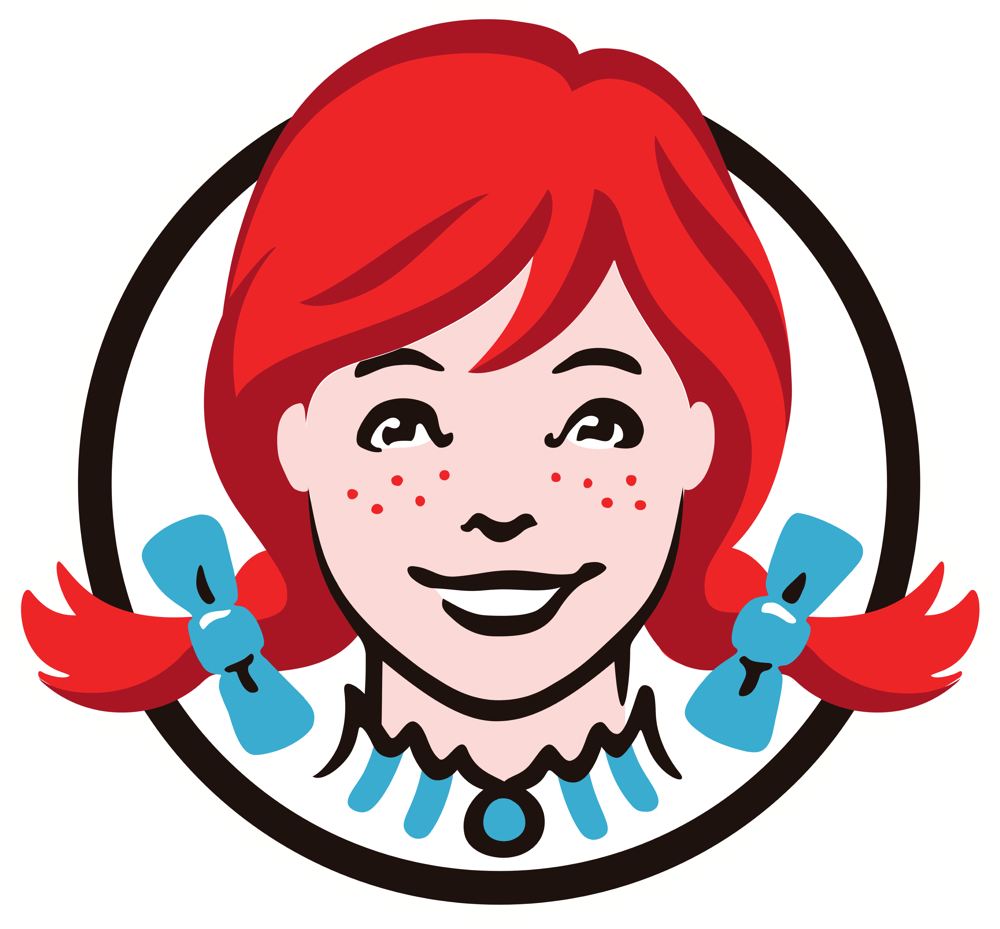

Some logos need a second, third or even fourth look to discover all the hidden messages.

Below is a list of food brand logos that have an interesting story behind them. 

   1. Wendy’s

One of the most popular and beloved fast-food chains is named after the daughter of founder Dave Thomas. The logo (featured below) is of Wendy as a child. Although to the untrained eye, the logo features a just a redhead dressed in a blue and white dress, Dave Thomas managed to put another family member in the logo as well. Just a closer look will reveal the word MOM written on Wendy’s collar. Family business at its finest.

Apparently, Dave Thomas regretted using his daughter’s name for the company, and [this](https://www.today.com/food/wendy-s-founder-dave-thomas-regretted-using-his-daughter-s-t167624) is the emotional reason why – as recalled by Wendy herself. 

Also, this is what Wendy looks like now. (Along with other famous food figures) 