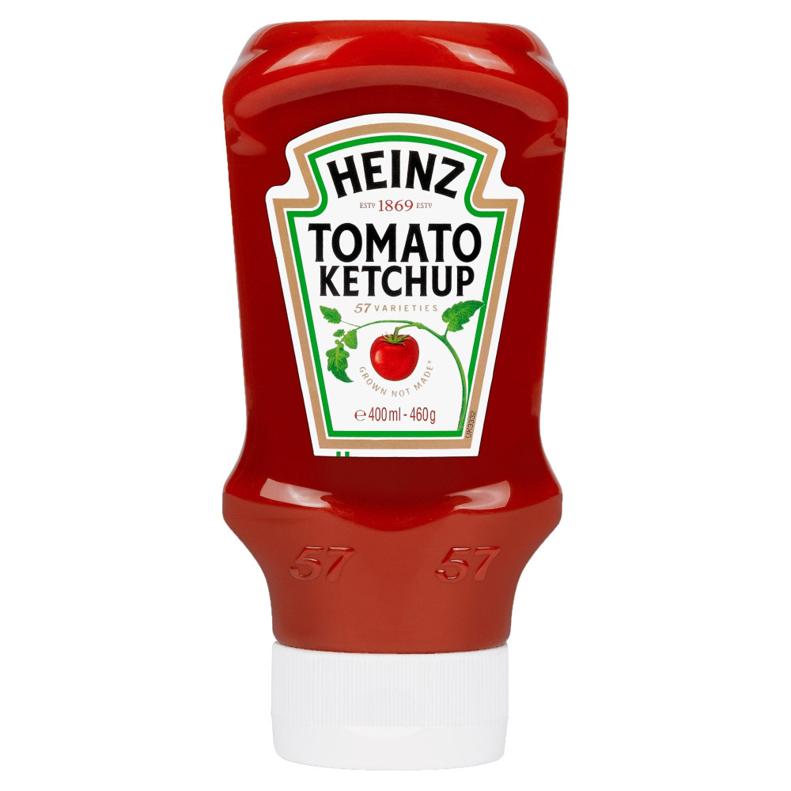

Some logos need a second, third or even fourth look to discover all the hidden messages.

Below is a list of food brand logos that have an interesting story behind them. 

### 1. Wendy’s

One of the most popular and beloved fast-food chains is named after the daughter of founder Dave Thomas. The logo (featured below) is of Wendy as a child. Although to the untrained eye, the logo features a just a redhead dressed in a blue and white dress, Dave Thomas managed to put another family member in the logo as well. Just a closer look will reveal the word MOM written on Wendy’s collar. Family business at its finest.

Apparently, Dave Thomas regretted using his daughter’s name for the company, and [this](https://www.today.com/food/wendy-s-founder-dave-thomas-regretted-using-his-daughter-s-t167624) is the emotional reason why – as recalled by Wendy herself. 

Also, [this is what Wendy looks like now](https://www.tasteofhome.com/collection/famous-food-brand-figures-in-real-life/). (Along with other famous food figures) 

### 2. Toblerone

With its 108 years of history, it is no wonder Toblerone has many surprises and hidden facts behind their logo and products.

Toblerone was founded in Bern, Switzerland. The city’s name translates to *bear*, which is exactly what is hidden in the mountain illustration. 

Here’s a [list](https://www.businessinsider.com/9-things-you-never-knew-about-toblerone-2016-11?r=US&IR=T) of 9 things you might not have known about the beloved Swiss chocolate.

### 3. Hershey's Kisses

In 2017, Matthew Santoro’s [YouTube video](https://www.youtube.com/watch?v=FdRCBaQTbfc) went viral, as he revealed hidden images in popular food logos. While some were common knowledge, one that really stuck with the public was the extra secret Hershey’s Kiss hidden on the packaging. 

Do you see it? 
Look closer at the space between the K and I.

There it is!

### 4. Twix

Yet another chocolate brand on this list. Not surprising.

It seems as though those little vertical lines in the dot of the I represent the [left-Twix vs right-Twix](https://www.mashed.com/349268/is-there-actually-any-difference-between-left-twix-and-right-twix/) campaign.

Before their successful “divisive” campaign ***[Try both. Pick a side.](https://www.twix.com/)***, the chocolate bar’s logo has had a few versions throughout the years. 
They have kept the same – or very similar – colour schemes since their first logo in 1979, though the change of typeface in 2010 was the brand’s biggest typographical change since the very beginning. 

### 5. Heinz Ketchup

You might have noticed on the Heinz ketchup bottle the *“57 varieties”* text written just below the famous logo.

The surprising thing is that it doesn’t even represent the number of Heinz products or varieties. Back in the day when it was founded, 57 was actually a combination of founder Henry Heinz’ lucky number 5, and his wife’s 7. And since 1886 (when Heinz Tomato Ketchup was first launched in the UK), the number 57 stuck with the brand.

And the number 57 on the ketchup bottle is not the only element with a story behind it. The placement of the number itself has [a very important reason. ](https://www.ladbible.com/more/awesome-the-57-on-a-bottle-of-heinz-ketchup-is-put-in-a-specific-position-20160716#:~:text=It's%20pretty%20common%20knowledge%20that,'57%20varieties'%20has%20stuck.)

These are just 5 sneaky food logos with meanings you probably did not know about. Remember that behind every design, there’s a story more interesting than you might think. 

So, the next time you pass by your favourite fast-food chain or restaurant, *look closely*. What do you really see?