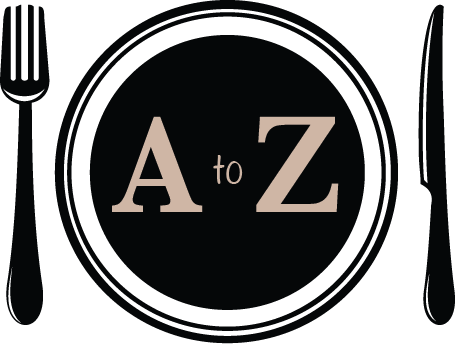
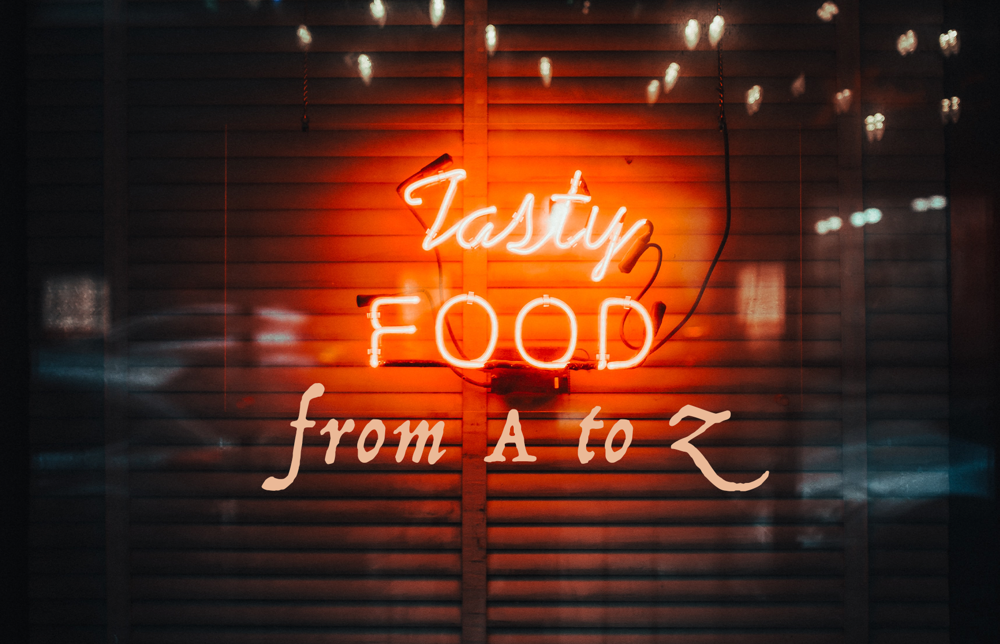
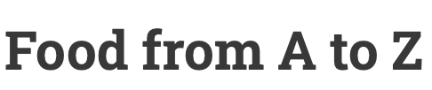

What do fonts and juicy burgers have in common? What about colours and those fancy restaurants in the city centre? 

#### This website looks into the importance of typography across the entire food industry.

There are so many backstories and thoroughly researched reasons why some words on your Tesco grocery items are smaller than others, or how the use of colours in restaurant logos can change the entire energy it gives off.

One could say that the typographical differences between McDonald’s and The Ivy’s logos are quite self-explanatory, right? Well, they are… to some extent. 

But the way fonts and colours attract different types of consumers is still not that clear to most people.

If you have ever been curious about the way fast food companies use fonts and hues to create a strong, recognisable brand, or how fancy restaurants’ logos attract a certain type of clientele, then this website is for you.

You will find examples of different uses of typography across the food industry:

* Tesco logo and personalised font
* the development of the McDonald’s logo and some of their successful – and not that successful – ads
* a clear parallel between typography in fast food companies versus in high-class restaurants 
* rare fonts that are seen in certain sectors of the food industry.

## Logo and Banner

My logo is shown below (in its full-size, easier-to-criticise version). Featuring a minimalist, yet slightly sophisticated icon of a plate with cutlery, it makes it clear from the very beginning what this website is about. 

I used neutrals and non-colours for my logo, so that it does not distract from the colourful front page and banner.

And speaking of the banner, the red and orange bright hues match the topics I talk about – fast food logos, supermarket chain typefaces – and creates an edgy, vibrant aesthetic.

As I look into everything typography-related in the food industry from fine dining restaurants to price offers at supermarkets, I believe that a balance is struck between the simplicity of the logo and the vividness of the banner. 

## Title

The *title* of my website is quite straightforward – articles ranging on topics from within the food industry. Everything you need to know about the link between typography and food. From A to Z.

##### Also, some honourable mentions:

This guy is doing a great job at redesigning the Tesco logo, so that it loses all meaning and branding we all assocaite with the supermarket chain: <https://www.youtube.com/watch?v=DHoz7UyvVdk>

Fun watching food (and not only) brands completely transform when the logos are all Comic Sans: <https://www.youtube.com/watch?v=u56w2O6o_fU>